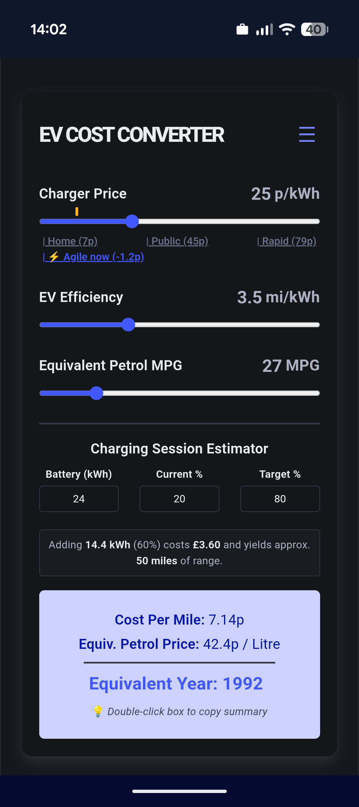

# EV Cost Converter

A progressive web app that converts electric vehicle (EV) charging costs to historical petrol price equivalents, helping you quickly understand how EV charging costs compare to traditional petrol cars.



## Features

- **Quick Cost Comparison**: Convert your EV charging price per mile to a petrol price equivalent
- **Customizable Settings**: Adjust EV charging rates, efficiency, and petrol prices to match your local conditions
- **Battery Calculator**: Calculate charging costs for specific battery capacity and state of charge ranges
- **Device Motion Support**: Shake your device to quickly toggle between settings (on supported mobile devices)
- **Persistent Settings**: Your preferences are saved in browser storage
- **Offline Support**: Works as a PWA (Progressive Web App) for full offline functionality
- **Responsive Design**: Optimized for desktop and mobile devices

## Quick Start

### Installation

```bash
# Clone the repository
git clone https://github.com/emrysr/ev-costs-converter.git
cd ev-costs-converter

# Install dependencies
npm install

# Start the development server
npm run dev
```

The app will be available at `http://localhost:5173`

### Building for Production

```bash
# Build for production
npm run build

# Preview the production build
npm run preview
```

## Usage

1. **Set Your Rates**:
   - Enter your electricity rate (in pence per kWh)
   - Enter your EV efficiency (in miles per kWh)
   - Enter your local petrol price (in pence per litre)

2. **View Cost Comparison**:
   - The app automatically calculates your cost per mile
   - See the equivalent petrol price per litre
   - Compare to historical year equivalents

3. **Calculate Battery Charging Costs** (Optional):
   - Enter your battery capacity (in kWh)
   - Set current and target state of charge
   - See the cost to charge between those ranges

4. **Save Your Settings**:
   - All preferences are automatically saved to your browser
   - Shake your device to quickly toggle settings (if enabled and supported)

## Technology Stack

- **Framework**: Vue 3 with `<script setup>` composition API
- **Build Tool**: Vite
- **Styling**: Bulma CSS framework
- **PWA Support**: vite-plugin-pwa for offline functionality
- **Language**: TypeScript
- **Type Checking**: Vite plugin checker

## Settings Reference

### Electricity & Efficiency
- **EV Charging Rate**: Your electricity cost per kWh (default: 25p)
- **EV Efficiency**: How far your EV travels per kWh (default: 3.5 miles/kWh)

### Petrol Comparison
- **Petrol MPG**: Reference car's fuel efficiency (default: 45 mpg)
- **Petrol Price**: Current or historical petrol price per litre (default: 142.8p)

### Battery Calculator
- **Battery Capacity**: Your EV's usable battery capacity in kWh
- **Current SOC**: Current state of charge percentage
- **Target SOC**: Target state of charge percentage

### Device Motion (Mobile)
- **Shake Detection**: Toggle on/off to control settings with device motion
- **Shake Threshold**: Sensitivity of shake detection

## Project Structure

```
src/
├── App.vue              # Main application component with cost calculations
├── main.ts              # Application entry point
├── components/          # Vue components
├── assets/              # Images and SVG assets
└── styles/              # CSS styling
```

## Development

The app uses Vue 3's `<script setup>` syntax for a modern, streamlined development experience. All calculations are reactive and update in real-time as you adjust settings.

### Local Storage

Settings are automatically persisted to browser storage:
- EV charging rate
- EV efficiency
- Petrol MPG
- Battery capacity
- State of charge values
- Device motion preferences

Clear all settings from the Options dialog to reset to defaults.

## Browser Support

- Modern browsers (Chrome, Firefox, Safari, Edge)
- Mobile browsers for PWA support
- iOS 16+ for device motion support
- Android devices with DeviceMotionEvent support

## PWA Installation

### Desktop
1. Visit the app in your browser
2. Look for the install icon in the address bar
3. Click to install as an app

### Mobile
1. Open the app in your mobile browser
2. Look for the "Add to Home Screen" or "Install" option
3. Confirm to install

Once installed, the app works offline and can be launched like any native app.

## License

This project is open source and available under the MIT License.

## Contributing

Contributions are welcome! Feel free to:
- Report bugs or suggest features via Issues
- Submit pull requests with improvements
- Improve documentation and user experience

## Contact

For questions or suggestions, please open an issue on the GitHub repository.
